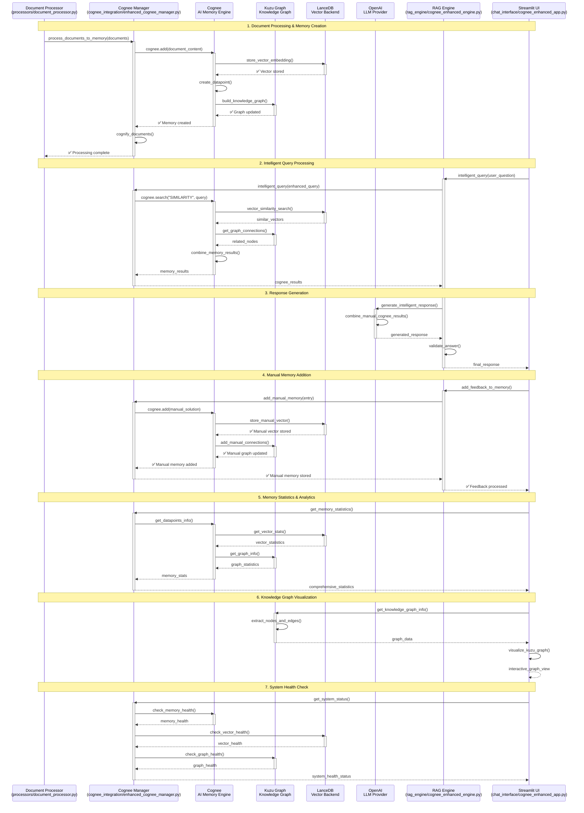

# Cognee AI Memory Operations Sequence Diagram

## Overview
This sequence diagram illustrates the complete flow of Cognee AI memory operations in the Electronics_SupportAgent system, including document processing, AI memory creation, knowledge graph building, and intelligent query processing.

## Sequence Diagram



## Key Operations Explained

### 1. Document Processing & Memory Creation
- **File**: `cognee_integration/enhanced_cognee_manager.py` (lines 1-200)
- **Flow**: Document Processor → Cognee Manager → Cognee → LanceDB + Kuzu
- **Key Methods**: `process_documents_to_memory()`, `cognee.add()`, `cognee.cognify()`

### 2. Intelligent Query Processing
- **File**: `cognee_integration/enhanced_cognee_manager.py` (lines 200-300)
- **Flow**: RAG Engine → Cognee Manager → Cognee → LanceDB + Kuzu
- **Key Methods**: `intelligent_query()`, `cognee.search()`, `get_graph_connections()`

### 3. Response Generation
- **File**: `rag_engine/cognee_enhanced_engine.py` (lines 100-200)
- **Flow**: RAG Engine → OpenAI → Validation → Response
- **Key Methods**: `generate_intelligent_response()`, `validate_answer()`

### 4. Manual Memory Addition
- **File**: `cognee_integration/enhanced_cognee_manager.py` (lines 300-400)
- **Flow**: RAG Engine → Cognee Manager → Cognee → LanceDB + Kuzu
- **Key Methods**: `add_manual_memory()`, `cognee.add()`

### 5. Memory Statistics & Analytics
- **File**: `cognee_integration/enhanced_cognee_manager.py` (lines 400-500)
- **Flow**: UI → Cognee Manager → Cognee → LanceDB + Kuzu
- **Key Methods**: `get_memory_statistics()`, `get_datapoints_info()`

### 6. Knowledge Graph Visualization
- **File**: `visualize_kuzu_graph.py` (lines 1-150)
- **Flow**: UI → Kuzu Graph → Visualization
- **Key Methods**: `get_knowledge_graph_info()`, `visualize_kuzu_graph()`

### 7. System Health Check
- **File**: `cognee_integration/enhanced_cognee_manager.py` (lines 500-600)
- **Flow**: UI → Cognee Manager → All Components
- **Key Methods**: `get_system_status()`, `check_memory_health()`

## Cognee Configuration

### Vector Engine Setup
```python
# Configure Cognee to use LanceDB as vector backend
cognee.config.set_vector_engine('lancedb', {
    'db_path': self.config["vector_db_path"]
})

# Configure OpenAI as LLM provider
cognee.config.set_llm_provider('openai', {
    'api_key': os.getenv('OPENAI_API_KEY')
})
```

### Memory Creation Process
```python
# Add documents to Cognee memory
await cognee.add(document_content)

# Cognify documents to build knowledge graphs
await cognee.cognify()
```

### Intelligent Search
```python
# Search Cognee memory with similarity
results = await cognee.search("SIMILARITY", query=enhanced_query)

# Get graph connections
graph_connections = await cognee.get_graph_connections()
```

## Database Integration

### LanceDB as Vector Backend
- **Purpose**: Store high-dimensional vector embeddings
- **Operations**: Vector similarity search, embedding storage
- **Integration**: Configured as Cognee's vector engine

### Kuzu as Knowledge Graph
- **Purpose**: Store semantic relationships and connections
- **Operations**: Graph traversal, relationship mapping
- **Integration**: Built automatically by Cognee's cognify process

## Key Features

### AI Memory Engine
- **Semantic Memory**: Contextual understanding of documents
- **Knowledge Graphs**: Automatic relationship discovery
- **Vector Search**: High-dimensional similarity matching
- **Memory Persistence**: Long-term knowledge retention

### Intelligent Processing
- **Document Cognification**: Transform documents into structured memories
- **Graph Building**: Automatic knowledge graph construction
- **Semantic Search**: Context-aware query processing
- **Memory Integration**: Combine multiple knowledge sources

### Advanced Analytics
- **Memory Statistics**: Comprehensive memory usage metrics
- **Graph Visualization**: Interactive knowledge graph display
- **Health Monitoring**: System component status checks
- **Performance Metrics**: Query response time and accuracy

## Error Handling

### Common Issues
1. **API Compatibility**: Handle Cognee API version changes
2. **Memory Limits**: Monitor memory usage and cleanup
3. **Graph Complexity**: Manage large knowledge graphs
4. **Vector Dimensions**: Ensure consistent embedding dimensions

### Debugging Steps
1. Check Cognee configuration
2. Verify vector engine connection
3. Monitor memory usage
4. Test graph operations
5. Validate API responses

## Performance Optimization

### Memory Management
- **Batch Processing**: Process documents in batches
- **Memory Cleanup**: Regular memory optimization
- **Graph Pruning**: Remove irrelevant connections
- **Vector Compression**: Optimize storage efficiency

### Query Optimization
- **Caching**: Cache frequent query results
- **Indexing**: Optimize vector search performance
- **Parallel Processing**: Concurrent memory operations
- **Result Filtering**: Smart result ranking and filtering 