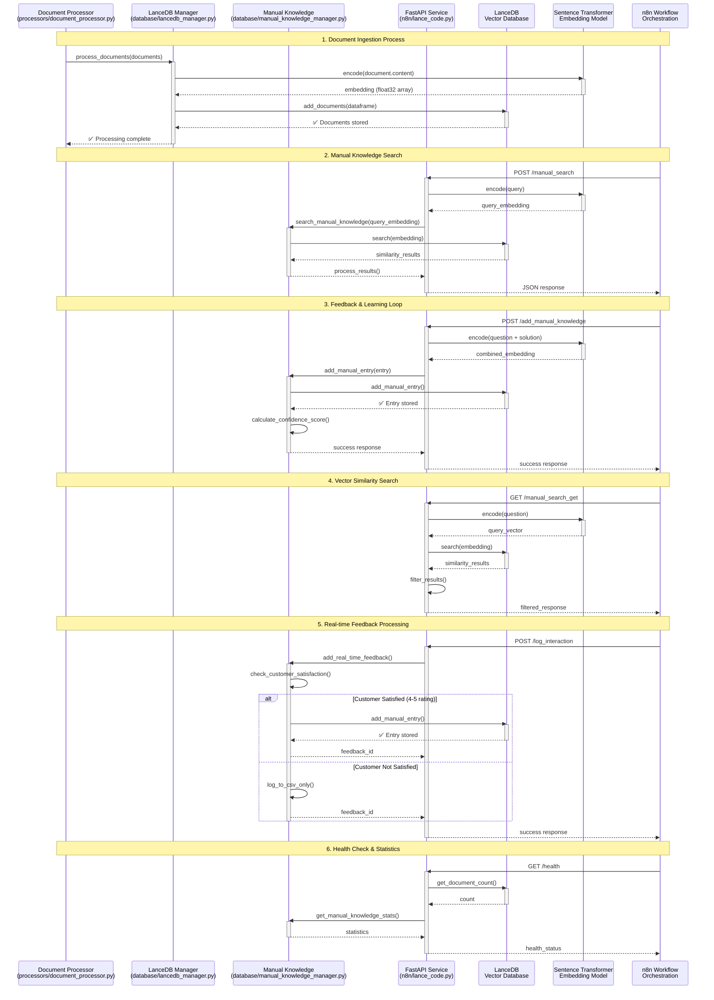

# LanceDB Operations Sequence Diagram

## Overview
This sequence diagram illustrates the complete flow of LanceDB operations in the Electronics_SupportAgent system, including document ingestion, vector search, manual knowledge management, and API interactions.

## Sequence Diagram



## Key Operations Explained

### 1. Document Ingestion Process
- **File**: `database/lancedb_manager.py` (lines 1-135)
- **Flow**: Document Processor → LanceDB Manager → Sentence Transformer → LanceDB
- **Key Methods**: `add_documents()`, `_initialize_table()`, `encode()`

### 2. Manual Knowledge Search
- **File**: `n8n/lance_code.py` (lines 1-422)
- **Flow**: n8n Workflow → FastAPI Service → Manual Knowledge Manager → LanceDB
- **Key Methods**: `search_manual_knowledge()`, `encode()`, `search()`

### 3. Feedback & Learning Loop
- **File**: `database/manual_knowledge_manager.py` (lines 1-343)
- **Flow**: n8n Workflow → FastAPI Service → Manual Knowledge Manager → LanceDB
- **Key Methods**: `add_real_time_feedback()`, `_add_manual_entry()`, `calculate_confidence_score()`

### 4. Vector Similarity Search
- **File**: `n8n/lance_code.py` (lines 300-422)
- **Flow**: n8n Workflow → FastAPI Service → Sentence Transformer → LanceDB
- **Key Methods**: `manual_search_get()`, `encode()`, `search()`

### 5. Real-time Feedback Processing
- **File**: `database/manual_knowledge_manager.py` (lines 150-200)
- **Flow**: n8n Workflow → FastAPI Service → Manual Knowledge Manager → LanceDB
- **Key Methods**: `add_real_time_feedback()`, `check_customer_satisfaction()`

### 6. Health Check & Statistics
- **File**: `n8n/lance_code.py` (lines 350-422)
- **Flow**: n8n Workflow → FastAPI Service → LanceDB/Manual Knowledge
- **Key Methods**: `health_check()`, `get_stats()`, `get_manual_knowledge_stats()`

## Database Schema

### LanceDB Knowledge Base Table
```python
schema = pa.schema([
    pa.field("id", pa.string()),
    pa.field("content", pa.string()),
    pa.field("embedding", pa.list_(pa.float32(), VECTOR_DIMENSION)),
    pa.field("metadata", pa.string()),
    pa.field("brand", pa.string()),
    pa.field("product_category", pa.string()),
    pa.field("document_type", pa.string()),
    pa.field("file_name", pa.string()),
    pa.field("chunk_index", pa.int64())
])
```

### Manual Knowledge Table
```python
schema = pa.schema([
    pa.field("id", pa.string()),
    pa.field("question", pa.string()),
    pa.field("solution", pa.string()),
    pa.field("embedding", pa.list_(pa.float32(), VECTOR_DIMENSION)),
    pa.field("brand", pa.string()),
    pa.field("product_category", pa.string()),
    pa.field("issue_category", pa.string()),
    pa.field("resolution_method", pa.string()),
    pa.field("timestamp", pa.string()),
    pa.field("source_type", pa.string()),
    pa.field("tags", pa.string()),
    pa.field("confidence_score", pa.float32())
])
```

## API Endpoints

### FastAPI Service (`n8n/lance_code.py`)
- `POST /manual_search` - Search manual knowledge
- `POST /add_manual_knowledge` - Add new manual knowledge
- `POST /validate_answer` - Validate answer quality
- `POST /log_interaction` - Log user interactions
- `GET /health` - Health check
- `GET /stats` - System statistics
- `GET /manual_search_get` - GET-based search

## Key Features

### Vector Operations
- **Embedding Generation**: Using SentenceTransformer model
- **Similarity Search**: Vector-based similarity scoring
- **Confidence Scoring**: Combined similarity and stored confidence
- **Filtering**: Brand and product-specific filtering

### Manual Knowledge Management
- **Real-time Addition**: Immediate feedback processing
- **Confidence Scoring**: Based on recency and tags
- **Duplicate Prevention**: Check existing entries
- **CSV Logging**: Backup logging system

### API Integration
- **RESTful Endpoints**: FastAPI service
- **n8n Integration**: Workflow orchestration
- **Error Handling**: Robust error recovery
- **Health Monitoring**: System status checks

## Error Handling

### Common Issues
1. **Schema Mismatch**: Ensure proper PyArrow schema definition
2. **Vector Format**: Convert embeddings to float32 lists
3. **API Compatibility**: Handle parameter name changes
4. **Connection Issues**: IPv4 vs IPv6 addressing

### Debugging Steps
1. Check LanceDB table schema
2. Verify embedding format (float32)
3. Test API endpoints with curl
4. Monitor service logs
5. Validate data types in responses 