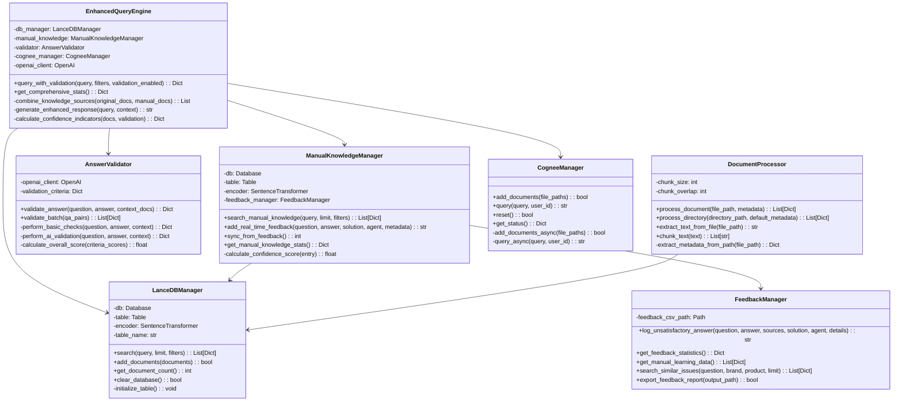
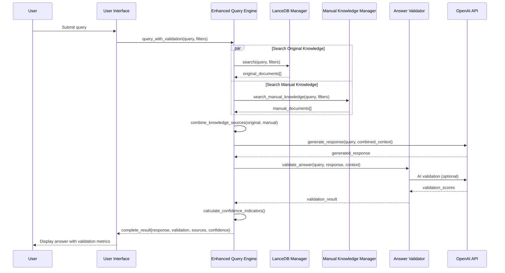
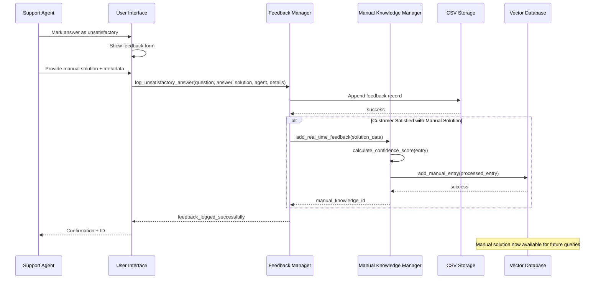
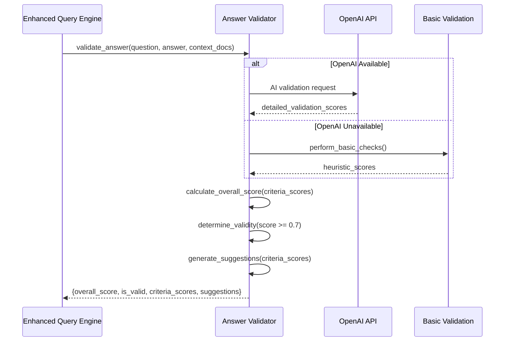

# Architecture & Design Document
## Enhanced RAG Knowledge Base System

**Version:** 1.0  
**Date:** January 2025  
**Author:** Engineering Team  

---

## 1. System Architecture Overview

### 1.1 High-Level Architecture

```
┌─────────────────────────────────────────────────────────────────┐
│                    User Interface Layer                         │
├─────────────────────┬─────────────────────┬─────────────────────┤
│   Streamlit Web UI  │      CLI Interface  │    API Endpoints    │
│   (enhanced_app.py) │     (main_enhanced) │     (future)        │
└─────────────────────┴─────────────────────┴─────────────────────┘
                              │
┌─────────────────────────────▼─────────────────────────────────────┐
│                   Application Layer                              │
├─────────────────────┬─────────────────────┬─────────────────────┤
│  Enhanced Query     │   Validation        │   Feedback          │
│  Engine             │   System            │   Management        │
│  (query_engine.py)  │   (validator.py)    │   (feedback_mgr.py) │
└─────────────────────┴─────────────────────┴─────────────────────┘
                              │
┌─────────────────────────────▼─────────────────────────────────────┐
│                     Data Layer                                   │
├─────────────────────┬─────────────────────┬─────────────────────┤
│   Original          │   Manual Knowledge  │   Feedback          │
│   Knowledge DB      │   Database          │   Storage           │
│   (LanceDB)         │   (LanceDB)         │   (CSV + Reports)   │
└─────────────────────┴─────────────────────┴─────────────────────┘
                              │
┌─────────────────────────────▼─────────────────────────────────────┐
│                 External Services                                │
├─────────────────────┬─────────────────────┬─────────────────────┤
│   OpenAI API        │   Cognee AI         │   Embedding Model   │
│   (GPT-3.5/4)       │   (Knowledge Graph) │   (SentenceTransf.) │
└─────────────────────┴─────────────────────┴─────────────────────┘
```

### 1.2 Component Interaction Flow

```
User Query → Enhanced Query Engine → Dual Knowledge Search → Answer Generation → Validation → Response + Feedback Collection
```

---

## 2. Class Diagram



---

## 3. Sequence Diagrams

### 3.1 Enhanced Query Processing



### 3.2 Feedback Collection and Learning



### 3.3 Answer Validation Process



---

## 4. Data Flow Diagrams

### 4.1 Document Ingestion Flow

```
Raw Documents (.pdf, .docx, .txt) 
    ↓
Document Processor
    ↓ (extract text)
Text Chunks (500 words, 50 word overlap)
    ↓ (generate embeddings)
Vector Embeddings (384 dimensions)
    ↓ (add metadata)
Structured Documents {id, content, embedding, metadata}
    ↓
LanceDB Storage (Original Knowledge Base)
```

### 4.2 Manual Knowledge Flow

```
Unsatisfactory Answer
    ↓
Support Agent Manual Solution
    ↓
Feedback Manager (CSV logging)
    ↓ (if customer satisfied)
Manual Knowledge Manager
    ↓ (confidence scoring)
Manual Knowledge Vector Database
    ↓ (immediate availability)
Future Query Responses (higher priority)
```

### 4.3 Query Processing Flow

```
User Query
    ↓
Enhanced Query Engine
    ├─→ Original Knowledge Search (LanceDB)
    └─→ Manual Knowledge Search (Manual DB)
    ↓ (combine & prioritize)
Unified Context (manual solutions prioritized)
    ↓
Response Generation (OpenAI + fallback)
    ↓
Answer Validation (scoring & suggestions)
    ↓
Final Response {answer, validation, confidence, sources}
```

---

## 5. Database Schema

### 5.1 Original Knowledge Base (LanceDB)

```sql
CREATE TABLE knowledge_base (
    id STRING,                    -- Unique document chunk ID
    content STRING,               -- Text content of chunk  
    embedding VECTOR(384),        -- Float32 embedding vector
    metadata STRING,              -- JSON metadata
    brand STRING,                 -- Samsung, LG
    product_category STRING,      -- TV, Refrigerator, etc.
    document_type STRING,         -- SOP, FAQ, Manual
    file_name STRING,             -- Original filename
    chunk_index INT64             -- Chunk number in document
);
```

### 5.2 Manual Knowledge Base (LanceDB)

```sql
CREATE TABLE manual_knowledge (
    id STRING,                    -- Feedback ID
    question STRING,              -- Customer question
    solution STRING,              -- Manual solution text
    embedding VECTOR(384),        -- Embedding of question+solution
    brand STRING,                 -- Product brand
    product_category STRING,      -- Product category
    issue_category STRING,        -- Type of issue
    resolution_method STRING,     -- How it was resolved
    timestamp STRING,             -- ISO timestamp
    source_type STRING,           -- manual, real_time_manual
    tags STRING,                  -- JSON array of tags
    confidence_score FLOAT32      -- 0.0-1.0 confidence
);
```

### 5.3 Feedback Log (CSV)

```csv
feedback_id,timestamp,user_question,original_answer,original_sources,feedback_type,manual_solution,support_agent,brand,product_category,issue_category,resolution_method,customer_satisfaction,tags,notes
```

---

## 6. API Design

### 6.1 Core API Endpoints (Future)

```python
# Query endpoint
POST /api/v1/query
{
    "query": "Samsung TV won't turn on",
    "filters": {"brand": "Samsung", "product_category": "TV"},
    "validation_enabled": true,
    "use_cognee": false
}

Response:
{
    "response": "generated answer",
    "confidence_indicators": {...},
    "validation": {...},
    "sources": {...}
}

# Feedback endpoint  
POST /api/v1/feedback
{
    "user_question": "...",
    "original_answer": "...",
    "manual_solution": "...",
    "support_agent": "Agent Name",
    "metadata": {...}
}

# Analytics endpoint
GET /api/v1/analytics
Response:
{
    "total_documents": 1000,
    "manual_solutions": 50,
    "validation_metrics": {...},
    "feedback_stats": {...}
}
```

### 6.2 Internal API Structure

```python
class EnhancedQueryEngine:
    def query_with_validation(
        query: str,
        filters: Optional[Dict[str, str]] = None,
        use_cognee: bool = False,
        validation_enabled: bool = True
    ) -> Dict[str, Any]:
        """
        Returns:
        {
            "response": str,
            "response_source": str,
            "original_sources": List[Dict],
            "manual_sources": List[Dict], 
            "total_sources": int,
            "validation": Dict,
            "confidence_indicators": Dict
        }
        """
```

---

## 7. Security Architecture

### 7.1 Authentication & Authorization

```
┌─────────────────────────────────────────────────────────────┐
│                    Security Layers                          │
├─────────────────────┬─────────────────────┬─────────────────┤
│   API Gateway       │   Application       │   Data Layer    │
│   - Rate Limiting   │   - Role-based      │   - Encryption  │
│   - IP Whitelisting │     Access Control  │   - Access      │
│   - API Keys        │   - Session Mgmt    │     Controls    │
└─────────────────────┴─────────────────────┴─────────────────┘
```

### 7.2 Data Security

- **Encryption at Rest**: All databases encrypted with AES-256
- **Encryption in Transit**: TLS 1.3 for all API communications
- **Access Control**: Role-based permissions for different operations
- **Audit Logging**: All operations logged with user attribution

---

## 8. Performance Architecture

### 8.1 Caching Strategy

```
Query → Cache Check → Vector Search → Response Generation → Cache Store
    ↑        ↓              ↑                    ↑
    └─ Cache Hit ────────────┘                    │
                                                  │
Response Cache (Redis) ←──────────────────────────┘
- TTL: 1 hour for static queries
- Invalidation: When knowledge base updates
```

### 8.2 Scaling Considerations

```
Load Balancer
    ↓
Application Instances (Horizontal Scaling)
    ↓
Vector Database Cluster (LanceDB)
    ↓  
Shared Storage (NFS/S3)
```

**Scaling Metrics**:
- **Memory**: 4GB per application instance
- **CPU**: 2 cores per instance for embedding generation
- **Storage**: 100GB for 10K documents + embeddings
- **Network**: 1Gbps for real-time query processing

---

## 9. Deployment Architecture

### 9.1 Development Environment

```
Local Development
├── Docker Compose
│   ├── Application Container
│   ├── LanceDB Container  
│   ├── Redis Container (future)
│   └── Monitoring Container
├── Local Vector Databases
├── Environment Configuration (.env)
└── Sample Data
```

### 9.2 Production Environment (Future)

```
Production Deployment
├── Kubernetes Cluster
│   ├── Application Pods (3 replicas)
│   ├── Vector Database StatefulSet
│   ├── Redis Cluster
│   └── Monitoring Stack (Prometheus/Grafana)
├── External Services
│   ├── OpenAI API
│   ├── Cognee Service
│   └── Cloud Storage
└── Infrastructure
    ├── Load Balancer
    ├── CDN (for static assets)
    └── Backup Storage
```

---

## 10. Monitoring & Observability

### 10.1 Key Metrics

```python
# Performance Metrics
query_response_time = Histogram("query_response_seconds")
validation_time = Histogram("validation_response_seconds") 
concurrent_users = Gauge("active_users_count")

# Business Metrics  
validation_scores = Histogram("answer_validation_scores")
manual_solutions_added = Counter("manual_solutions_total")
feedback_by_type = Counter("feedback_total", ["type"])

# System Metrics
vector_db_size = Gauge("vector_database_documents")
memory_usage = Gauge("application_memory_bytes")
api_error_rate = Counter("api_errors_total", ["service"])
```

### 10.2 Alerting Rules

```yaml
# High error rate
- alert: HighErrorRate
  expr: rate(api_errors_total[5m]) > 0.1
  
# Slow response times  
- alert: SlowQueries
  expr: histogram_quantile(0.95, query_response_seconds) > 5
  
# Low validation scores
- alert: LowValidationScores  
  expr: rate(answer_validation_scores < 0.7) > 0.3
```

---

## 11. Error Handling & Resilience

### 11.1 Failure Modes & Recovery

```python
# Graceful Degradation Strategy
if openai_api_unavailable:
    return basic_response_with_context()
    
if vector_database_unavailable:
    return cached_response() or fallback_message()
    
if validation_service_unavailable:
    return response_without_validation()
```

### 11.2 Circuit Breaker Pattern

```python
@circuit_breaker(
    failure_threshold=5,
    timeout=30,
    expected_exception=OpenAIAPIError
)
def call_openai_api(prompt):
    # API call with automatic fallback
```

---

## 12. Technology Stack

### 12.1 Core Technologies

| Component | Technology | Version | Purpose |
|-----------|------------|---------|---------|
| Vector Database | LanceDB | 0.24+ | Semantic search |
| Embeddings | SentenceTransformers | 5.0+ | Text vectorization |
| AI/LLM | OpenAI GPT | 3.5/4 | Response generation |
| Knowledge Graph | Cognee | 0.2+ | Enhanced AI |
| Web Framework | Streamlit | 1.47+ | User interface |
| Data Processing | Pandas/NumPy | Latest | Data manipulation |
| File Processing | PyPDF2, python-docx | Latest | Document parsing |

### 12.2 Development Tools

| Tool | Purpose |
|------|---------|
| Python 3.12+ | Primary language |
| Poetry/pip | Dependency management |
| Black/isort | Code formatting |
| mypy | Type checking |
| pytest | Unit testing |
| Docker | Containerization |

---

## 13. Future Architecture Considerations

### 13.1 Microservices Migration

```
Current Monolith → Future Microservices
├── Query Service (FastAPI)
├── Validation Service (FastAPI)  
├── Feedback Service (FastAPI)
├── Knowledge Management Service (FastAPI)
└── API Gateway (Kong/Envoy)
```

### 13.2 Advanced Features

- **Real-time Collaboration**: WebSocket connections for live feedback
- **Advanced Analytics**: Machine learning for pattern detection
- **Multi-tenant**: Support for multiple customer deployments
- **Voice Interface**: Speech-to-text integration
- **Mobile Apps**: Native iOS/Android applications 